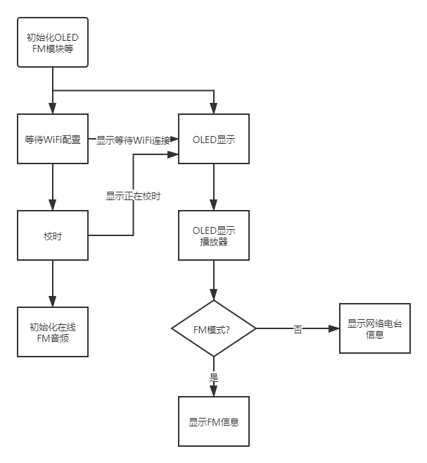

# 硬禾学堂2021暑假练平台3：基于ESP32-S2-Mini-1模块的音频处理平台

## 任务需求

实现网络收音机和FM收音机的功能

* 可以通过WiFi接收网络上的电台，也可以通过FM模块接收空中的电台，并可以通过案件进行切换、选台
* 在OLED显示屏上显示网络电台的IP地址、节目名称等相关信息或FM信号的频段
* 系统能够自动校时，开机后自动调节到准确的时间（年月日时分秒）

## 设计思路



使用四个按键来调整一些标志位，GUI中通过标志位来决定显示什么界面。

## 具体实现

### WiFi配置部分

WiFi配置部分主要使用了乐鑫提供的例程smartconfig。示例工程在`esp-idf\examples\wifi\smart_config`下，使用手机APP：EspTouch进行WiFi账号和密码的配置。改动不大，增加了一个全局标志位isConnect，在WiFi连接后置true。

### 校时部分

校时部分主要使用了乐鑫在CSDN上的文章，当然乐鑫也提供了例程，在`esp-idf\examples\protocols\sntp`下。CSDN上的文章中更为简略。同样的，我也添加了一个全局标志位isTimeCorrect。以下是我的代码

```c++
bool isTimeCorrect = false;

static const char *TAG = "sntp";

static void esp_initialize_sntp(void) {
    ESP_LOGI(TAG, "Initializing SNTP");
    sntp_setoperatingmode(SNTP_OPMODE_POLL);
    sntp_setservername(0, "ntp.tuna.tsinghua.edu.cn");
    sntp_setservername(1, "ntp1.aliyun.com");
    sntp_setservername(2, "210.72.145.44");
    sntp_init();
}

void esp_wait_sntp_sync(void) {
    char strftime_buf[64];
    esp_initialize_sntp();

    // wait for time to be set
    time_t now = 0;
    int retry = 0;
    struct tm timeinfo = {0};

    while (timeinfo.tm_year < (2019 - 1900)) {
        ESP_LOGD(TAG, "Waiting for system time to be set... (%d)", ++retry);
        vTaskDelay(100 / portTICK_PERIOD_MS);
        time(&now);
        localtime_r(&now, &timeinfo);
    }

    // set timezone to China Standard Time
    setenv("TZ", "CST-8", 1);
    tzset();

    strftime(strftime_buf, sizeof(strftime_buf), "%c", &timeinfo);
    ESP_LOGI(TAG, "The current date/time in Shanghai is: %s", strftime_buf);
    isTimeCorrect = true;

    sntp_stop();
}
```

### 在线音频流播放部分

在线音频流使用了蜻蜓FM提供的API。此部分主要参考了乐鑫esp-adf库的示例程序`esp-adf\examples\player\pipeline_living_stream`和`esp-adf\examples\player\pipeline_play_mp3_with_dac_or_pwm`。删去了解码芯片初始化、i2s初始化和WiFi初始化等部分，并将pipeline_living_stream中的i2s输出改为了pwm输出。参考示例程序增加了换台的部分。

```c++
void MY_AUDIO_Init() {
    esp_log_level_set("*", ESP_LOG_INFO);
    esp_log_level_set(TAG, ESP_LOG_DEBUG);

//    ESP_LOGI(TAG, "[ 1 ] Start audio codec chip");
//    audio_board_handle_t board_handle = audio_board_init();
//    audio_hal_ctrl_codec(board_handle->audio_hal, AUDIO_HAL_CODEC_MODE_DECODE, AUDIO_HAL_CTRL_START);

    ESP_LOGI(TAG, "[2.0] Create audio pipeline for playback");
    audio_pipeline_cfg_t pipeline_cfg = DEFAULT_AUDIO_PIPELINE_CONFIG();
    pipeline = audio_pipeline_init(&pipeline_cfg);

    ESP_LOGI(TAG, "[2.1] Create http stream to read data");
    http_stream_cfg_t http_cfg = HTTP_STREAM_CFG_DEFAULT();
    http_cfg.event_handle = _http_stream_event_handle;
    http_cfg.type = AUDIO_STREAM_READER;
    http_cfg.enable_playlist_parser = true;
    http_stream_reader = http_stream_init(&http_cfg);

    ESP_LOGI(TAG, "[2.2] Create pwm stream to write data to codec chip");
    pwm_stream_cfg_t pwm_cfg = PWM_STREAM_CFG_DEFAULT();
    pwm_cfg.pwm_config.gpio_num_left = AUDIO_Pin;
    pwm_cfg.pwm_config.gpio_num_right = AUDIO_Pin + 1;
    output_stream_writer = pwm_stream_init(&pwm_cfg);

    ESP_LOGI(TAG, "[2.3] Create aac decoder to decode aac file");
    aac_decoder_cfg_t aac_cfg = {
            .out_rb_size=(2 * 1024),
            .task_stack=(4 * 1024),
            .task_core=(0),
            .task_prio=(5),
            .stack_in_ext=1,
    };
    aac_decoder = aac_decoder_init(&aac_cfg);

    ESP_LOGI(TAG, "[2.4] Register all elements to audio pipeline");
    audio_pipeline_register(pipeline, http_stream_reader, "http");
    audio_pipeline_register(pipeline, aac_decoder, "aac");
    audio_pipeline_register(pipeline, output_stream_writer, "pwm");

    ESP_LOGI(TAG, "[2.5] Link it together http_stream-->aac_decoder-->pwm_stream");
    const char *link_tag[3] = {"http", "aac", "pwm"};
    audio_pipeline_link(pipeline, &link_tag[0], 3);

    ESP_LOGI(TAG, "[2.6] Set up  uri (http as http_stream, aac as aac decoder, and default output is pwm)");
    char url[100];
    sprintf(url, "http://open.ls.qingting.fm/live/%d/64k.m3u8?format=aac", stationIDList[stationID]);
    audio_element_set_uri(http_stream_reader, url);

//    ESP_LOGI(TAG, "[ 3 ] Start and wait for Wi-Fi network");
//    esp_periph_config_t periph_cfg = DEFAULT_ESP_PERIPH_SET_CONFIG();
//    set = esp_periph_set_init(&periph_cfg);
//    periph_wifi_cfg_t wifi_cfg = {
//            .ssid = (const char *) wifi_config.sta.ssid,
//            .password = (const char *) wifi_config.sta.password,
//    };
//    esp_periph_handle_t wifi_handle = periph_wifi_init(&wifi_cfg);
//    esp_periph_start(set, wifi_handle);
//    periph_wifi_wait_for_connected(wifi_handle, portMAX_DELAY);

    ESP_LOGI(TAG, "[ 4 ] Set up  event listener");
    audio_event_iface_cfg_t evt_cfg = AUDIO_EVENT_IFACE_DEFAULT_CFG();
    evt = audio_event_iface_init(&evt_cfg);

    ESP_LOGI(TAG, "[4.1] Listening event from all elements of pipeline");
    audio_pipeline_set_listener(pipeline, evt);

    ESP_LOGI(TAG, "[4.2] Listening event from peripherals");
//    audio_event_iface_set_listener(esp_periph_set_get_event_iface(set), evt);

    ESP_LOGI(TAG, "[ 5 ] Start audio_pipeline");
    audio_pipeline_run(pipeline);
}

void Audio_Play() {
    while (1) {
        audio_event_iface_msg_t msg;
        esp_err_t ret = audio_event_iface_listen(evt, &msg, portMAX_DELAY);
        if (ret != ESP_OK) {
            ESP_LOGE(TAG, "[ * ] Event interface error : %d", ret);
            continue;
        }

        if (msg.source_type == AUDIO_ELEMENT_TYPE_ELEMENT &&
            msg.source == (void *) aac_decoder &&
            msg.cmd == AEL_MSG_CMD_REPORT_MUSIC_INFO) {
            audio_element_info_t music_info = {0};
            audio_element_getinfo(aac_decoder, &music_info);

            ESP_LOGI(TAG, "[ * ] Receive music info from aac decoder, sample_rates=%d, bits=%d, ch=%d",
                     music_info.sample_rates, music_info.bits, music_info.channels);

            audio_element_setinfo(output_stream_writer, &music_info);
            pwm_stream_set_clk(output_stream_writer, music_info.sample_rates, music_info.bits, music_info.channels);
            continue;
        }

        /* restart stream when the first pipeline element (http_stream_reader in this case) receives stop event (caused by reading errors) */
        if (msg.source_type == AUDIO_ELEMENT_TYPE_ELEMENT && msg.source == (void *) http_stream_reader
            && msg.cmd == AEL_MSG_CMD_REPORT_STATUS && (int) msg.data == AEL_STATUS_ERROR_OPEN) {
            ESP_LOGW(TAG, "[ * ] Restart stream");
            audio_pipeline_stop(pipeline);
            audio_pipeline_wait_for_stop(pipeline);
            audio_element_reset_state(aac_decoder);
            audio_element_reset_state(output_stream_writer);
            audio_pipeline_reset_ringbuffer(pipeline);
            audio_pipeline_reset_items_state(pipeline);
            audio_pipeline_run(pipeline);
            continue;
        }
    }
}

void Audio_SelectStation(uint16_t new_stationID) {
    char url[100];
    sprintf(url, "http://open.ls.qingting.fm/live/%d/64k.m3u8?format=aac", stationIDList[new_stationID]);
    audio_pipeline_stop(pipeline);
    audio_pipeline_wait_for_stop(pipeline);
    audio_element_reset_state(aac_decoder);
    audio_element_reset_state(output_stream_writer);
    audio_pipeline_reset_ringbuffer(pipeline);
    audio_pipeline_reset_items_state(pipeline);
    audio_element_set_uri(http_stream_reader, url);
    audio_pipeline_run(pipeline);
}
```

### OLED底层驱动

OLED底层驱动还是使用了我的[祖传代码](https://github.com/kaidegit/HWDrivers4MCU/tree/main/OLED_SSD1306_i2c)，虽然是i2c的，但是稍微改改发送接口，从spi发送就可以正常使用了。

```c++
void MY_SPI_Init() {
    spi_bus_config_t buscfg = {
            .miso_io_num=-1,
            .mosi_io_num=OLED_MOSI_Pin,
            .sclk_io_num=OLED_CLK_Pin,
            .quadwp_io_num=-1,
            .quadhd_io_num=-1,
            .max_transfer_sz=0
    };
    spi_device_interface_config_t devcfg = {
            .clock_speed_hz=1 * 1000 * 1000,        //Clock out at 1 MHz
            .mode=0,                                //SPI mode 0
            .spics_io_num=-1,                       //CS pin
            .queue_size=7,                          //We want to be able to queue 7 transactions at a time
    };
    ESP_ERROR_CHECK(spi_bus_initialize(OLED_SPI_HOST, &buscfg, SPI_DMA_DISABLED));
    ESP_ERROR_CHECK(spi_bus_add_device(OLED_SPI_HOST, &devcfg, &oled_spi_handle));
}

spi_device_handle_t oled_spi_handle;

void oled_send(uint8_t dc, uint8_t data) {
    spi_transaction_t t = {0};
    t.length = 8;
    t.tx_buffer = &data;
    gpio_set_level(OLED_DC_Pin, dc == 0x40);
    spi_device_polling_transmit(oled_spi_handle, &t);
}
```

### FM底层驱动

这款FM芯片有个坑，它并非像传统的i2c设备一样，可以通过发送设备地址-发送寄存器地址-读或者写值这种操作方法来操作，而是只能顺序读取或者写入所有寄存器数据，具体可以参考数据手册。

由于没能找到比较好的驱动，我这里参考github上一个适配于arduino的程序自己写了一个较为简陋的驱动

```c++
struct RDA_Handler RDA5807;

RADIO_FREQ FMStationList[50] = {0};
uint16_t FMStationNum = 0;

void RDA_ReadAllInfo() {
    i2c_cmd_handle_t cmd = i2c_cmd_link_create();
    i2c_master_start(cmd);
    i2c_master_write_byte(cmd, 0x21, 1);
    // from 0x0A high to 0x0C low
    uint8_t i2c_data_array[6];
    // read 0x0A
    i2c_master_read_byte(cmd, i2c_data_array + 0, 0);
    i2c_master_read_byte(cmd, i2c_data_array + 1, 0);
    // read 0x0B
    i2c_master_read_byte(cmd, i2c_data_array + 2, 0);
    i2c_master_read_byte(cmd, i2c_data_array + 3, 0);
    // read 0x0C
    i2c_master_read_byte(cmd, i2c_data_array + 4, 0);
    i2c_master_read_byte(cmd, i2c_data_array + 5, 1);
    i2c_master_stop(cmd);
    i2c_master_cmd_begin(FM_I2C_HOST, cmd, 1000 / portTICK_RATE_MS);
    i2c_cmd_link_delete(cmd);
    RDA5807.radioInfo.rds = i2c_data_array[0] & 0x80;
    uint16_t readChan = ((i2c_data_array[0] & 0x03) << 8) + i2c_data_array[1];
    switch (RDA5807.band) {
        case RADIO_BAND_US:
            RDA5807.freq = RDA5807.channelSpacing * readChan + 87 * 1000;
            break;
        case RADIO_BAND_JP:
        case RADIO_BAND_WW:
            RDA5807.freq = RDA5807.channelSpacing * readChan + 76 * 1000;
            break;
        case RADIO_BAND_EE:
            RDA5807.freq = RDA5807.channelSpacing * readChan + 65 * 1000;
    }
    RDA5807.radioInfo.rssi = i2c_data_array[2] >> 2;
}

void RDA_WriteAllInfo() {
    i2c_cmd_handle_t cmd = i2c_cmd_link_create();
    i2c_master_start(cmd);
    i2c_master_write_byte(cmd, 0x20, 1);
    for (uint8_t i = 2; i < 8; i++) {
        i2c_master_write_byte(cmd, RDA5807.regList[i] >> 8, 1);
        i2c_master_write_byte(cmd, RDA5807.regList[i] & 0xff, 1);
    }
    i2c_master_stop(cmd);
    i2c_master_cmd_begin(FM_I2C_HOST, cmd, 1000 / portTICK_RATE_MS);
    i2c_cmd_link_delete(cmd);
}

void RDA_Init() {
    RDA5807.channelSpacing = 100;
    // Reg 0x00 and 0x01 are not used
    RDA5807.regList[0] = 0;
    RDA5807.regList[1] = 0;
    RDA5807.regList[2] = 0b11000000 << 8 | 0b00000011;
    RDA5807.regList[3] = 0b00000000 << 8 | 0b00000000;
    RDA5807.regList[4] = 0b00001000 << 8 | 0b00000000;
    RDA5807.regList[5] = 0b10000100 << 8 | 0b11010100;
    RDA5807.regList[6] = 0b00000000 << 8 | 0b00000000;
    RDA5807.regList[7] = 0b00000000 << 8 | 0b00000000;

    RDA_WriteAllInfo();
    RDA_Reset();
}

void RDA_Reset() {
    RDA5807.regList[RADIO_REG_CTRL] |= RADIO_REG_CTRL_RESET;
    RDA_WriteAllInfo();
    vTaskDelay(100 / portTICK_RATE_MS);
    RDA5807.regList[RADIO_REG_CTRL] &= !RADIO_REG_CTRL_RESET;
    RDA_WriteAllInfo();
}

void RDA_SetBandFrequency(enum RADIO_BAND newBand, RADIO_FREQ newFreq) {
    RDA_SetBand(newBand);
    RDA_SetFrequency(newFreq);
}

void RDA_SetFrequency(RADIO_FREQ newFreq) {
    RADIO_FREQ freqHigh, freqLow;
    switch (RDA5807.band) {
        case RADIO_BAND_US:
            freqLow = 87000;
            freqHigh = 108000;
            break;
        case RADIO_BAND_JP:
            freqLow = 76000;
            freqHigh = 91000;
            break;
        case RADIO_BAND_WW:
            freqLow = 76000;
            freqHigh = 108000;
            break;
        case RADIO_BAND_EE:
            freqLow = 65000;
            freqHigh = 76000;
            break;
        default:
            freqLow = 65000;
            freqHigh = 108000;
            break;
    }
    if (newFreq < freqLow) newFreq = freqLow;
    if (newFreq > freqHigh) newFreq = freqHigh;
    uint16_t regChannel = RDA5807.regList[RADIO_REG_CHAN] &
                          (RADIO_REG_CHAN_SPACE | RADIO_REG_CHAN_BAND);
    uint16_t newChannel = (newFreq - freqLow) / RDA5807.channelSpacing;
    regChannel += RADIO_REG_CHAN_TUNE; // enable tuning
    regChannel |= newChannel << 6;
    RDA5807.regList[RADIO_REG_CTRL] |=
            RADIO_REG_CTRL_OUTPUT | RADIO_REG_CTRL_UNMUTE |
            RADIO_REG_CTRL_RDS | RADIO_REG_CTRL_ENABLE; //  | RADIO_REG_CTRL_NEW
    RDA5807.regList[RADIO_REG_CHAN] = regChannel;
    RDA_WriteAllInfo();
}

void RDA_SetBand(enum RADIO_BAND newBand) {
    RDA5807.band = newBand;
    switch (newBand) {
        case RADIO_BAND_US:
            RDA5807.regList[RADIO_REG_CHAN] &= !RADIO_REG_CHAN_BAND;
            RDA5807.regList[RADIO_REG_CHAN] |= RADIO_REG_CHAN_BAND_US;
            break;
        case RADIO_BAND_JP:
            RDA5807.regList[RADIO_REG_CHAN] &= !RADIO_REG_CHAN_BAND;
            RDA5807.regList[RADIO_REG_CHAN] |= RADIO_REG_CHAN_BAND_JP;
            break;
        case RADIO_BAND_WW:
            RDA5807.regList[RADIO_REG_CHAN] &= !RADIO_REG_CHAN_BAND;
            RDA5807.regList[RADIO_REG_CHAN] |= RADIO_REG_CHAN_BAND_WW;
            break;
        case RADIO_BAND_EE:
            RDA5807.regList[RADIO_REG_CHAN] &= !RADIO_REG_CHAN_BAND;
            RDA5807.regList[RADIO_REG_CHAN] |= RADIO_REG_CHAN_BAND_EE;
            break;
        default:
            break;
    }
    RDA5807.regList[RADIO_REG_CHAN] |= RADIO_REG_CHAN_SPACE_100;
    RDA_WriteAllInfo();
}
```

### GUI部分

GUI部分我新建了一个线程，根据各个标志位来判断模式，显示各类信息

```c++
void GUI_Init() {
    xTaskCreate(GUI_Task, "GUI_Task", 4096, NULL, 3, NULL);
}
void GUI_Task() {
    while (1) {
        if (!isConnect) {
            OLED_ShowNotConnect();
            lastState = 0;
        } else {
            if (!isTimeCorrect) {
                OLED_ShowTimeCalibrating();
                lastState = 1;
            } else {
                OLED_ShowTime();
                if (isFM) {
                    OLED_ShowFM();
                    lastState = 2;
                } else {
                    OLED_ShowInternetFM();
                    lastState = 3;
                }
            }
        }
        vTaskDelay(100 / portTICK_RATE_MS);
    }
}
```

#### 显示提示

WiFi未连接时和连接后的校时时，显示一串字符串，表明状态

```c++
void OLED_ShowNotConnect() {
    if (lastState != 0) {
        OLED_Clear();
        OLED_ShowString(0, 0, (uint8_t *) "Wifi is not connected. Please Connect Wifi with EspTouch.", 16);
    }
}

void OLED_ShowTimeCalibrating() {
    if (lastState != 1) {
        OLED_Clear();
        OLED_ShowString(0, 0, (uint8_t *) "Wifi is connected. Trying to calibrate time...", 16);
    }
}
```

#### 显示FM界面。

显示FM的频段和信号强度（rssi）

```c++
uint32_t freq_temp = -1;
void OLED_ShowFM() {
    static uint8_t rssi_temp = -1;
    char ch[30];
    RDA_ReadAllInfo();
    if (lastState != 2) {
        OLED_Clear();
        SetMuxFM();
        OLED_ShowString(0, 0, (uint8_t *) "FM", 16);

        sprintf(ch, "freq:%6d", RDA5807.freq);
        OLED_ShowString(0, 2, (uint8_t *) ch, 16);
        freq_temp = RDA5807.freq;

        sprintf(ch, "rssi: %2d/64", RDA5807.radioInfo.rssi + 1);
        OLED_ShowString(0, 4, (uint8_t *) ch, 16);
        rssi_temp = RDA5807.radioInfo.rssi;

        OLED_ShowString(0, 6, (uint8_t *) "SW  Pre Nex Mute", 16);
    } else {
        if (freq_temp != RDA5807.freq) {
            sprintf(ch, "freq:%6d", freq_temp);
            OLED_ShowString(0, 2, (uint8_t *) ch, 16);
            RDA_SetFrequency(freq_temp);
        }
        if (rssi_temp != RDA5807.radioInfo.rssi) {
            sprintf(ch, "rssi: %2d/64", RDA5807.radioInfo.rssi + 1);
            OLED_ShowString(0, 4, (uint8_t *) ch, 16);
            rssi_temp = RDA5807.radioInfo.rssi;
        }
    }
}
```

#### 显示网络电台。

显示本次使用的电台蜻蜓FM的IP和当前节目名称。根据蜻蜓FM的开放平台的[品牌露出规范](https://open.qingting.fm/documents/9)，添加相应的字符

```c++
void OLED_ShowInternetFM() {
    static uint8_t stationID_temp = -1;
    char ch[30];
    if (lastState != 3) {
        OLED_Clear();
        SetMuxESP();
        OLED_ShowString(0, 0, (uint8_t *) "OL", 16);

        OLED_ShowString(0, 2, (uint8_t *) "IP:115.231.142.5", 16);

        sprintf(ch, "FM%4d", ConvStaIDToName(stationIDList[stationID]));
        OLED_ShowString(0, 4, (uint8_t *) ch, 16);
        stationID_temp = stationID;

        OLED_ShowQingtingLogo(6 * 8, 4);

        OLED_ShowString(0, 6, (uint8_t *) "SW  Pre Nex Mute", 16);
    } else {
        if (stationID_temp != stationID) {
            Audio_SelectStation(stationID);
            sprintf(ch, "FM%4d", ConvStaIDToName(stationIDList[stationID]));
            OLED_ShowString(0, 4, (uint8_t *) ch, 16);
            stationID_temp = stationID;
        }
    }
}
uint16_t ConvStaIDToName(uint16_t _stationID) {
    switch (_stationID) {
        case 4522:            return 930;      //FM93交通之声
        case 4518:            return 880;      //浙江之声
        case 1133:            return 918;      //杭州交通91.8电台
        case 1163:            return 1054;     //西湖之声
        case 4521:            return 996;      //浙江FM99.6
        case 1135:            return 922;      //嘉兴交通广播
        case 4866:            return 968;      //浙江音乐调频
        case 4523:            return 1070;     //浙江城市之声
        default:              return -1;
    }
}

void OLED_ShowQingtingLogo(uint8_t x, uint8_t y) {
    const uint8_t logo[][16] = {
            {0x00, 0x08, 0x08, 0x28, 0xC8, 0x08, 0x08, 0xFF, 0x08, 0x08, 0x88, 0x68, 0x08, 0x08, 0x00, 0x00},
            {0x21, 0x21, 0x11, 0x11, 0x09, 0x05, 0x03, 0xFF, 0x03, 0x05, 0x09, 0x11, 0x11, 0x21, 0x21, 0x00},/*"来",0*/

            {0x00, 0x00, 0x00, 0xF8, 0x88, 0x8C, 0x8A, 0x89, 0x88, 0x88, 0x88, 0xF8, 0x00, 0x00, 0x00, 0x00},
            {0x00, 0x00, 0x00, 0xFF, 0x44, 0x44, 0x44, 0x44, 0x44, 0x44, 0x44, 0xFF, 0x00, 0x00, 0x00, 0x00},/*"自",1*/

            {0x00, 0xF8, 0x08, 0xFF, 0x08, 0xF8, 0x44, 0x54, 0x54, 0x54, 0x7F, 0x54, 0x54, 0x54, 0x44, 0x00},
            {0x20, 0x63, 0x21, 0x1F, 0x11, 0x39, 0x00, 0xFF, 0x15, 0x15, 0x15, 0x55, 0x95, 0x7F, 0x00, 0x00},/*"蜻",2*/

            {0xF8, 0x08, 0xFF, 0x08, 0xF8, 0x00, 0x84, 0xE4, 0x9C, 0x00, 0x44, 0x44, 0xFC, 0x42, 0x42, 0x00},
            {0x23, 0x61, 0x3F, 0x11, 0xB9, 0x40, 0x26, 0x18, 0x27, 0x40, 0x48, 0x48, 0x4F, 0x48, 0x48, 0x00},/*"蜓",3*/
    };

    for (uint8_t j = 0; j < 2; j++) {
        OLED_Set_Pos(x + j * 16, y);
        for (uint8_t i = 0; i < 16; i++) {
            OLED_WR_DATA(logo[2 * j][i]);
        }
        OLED_Set_Pos(x + j * 16, y + 1);
        for (uint8_t i = 0; i < 16; i++) {
            OLED_WR_DATA(logo[2 * j + 1][i]);
        }
    }
//    OLED_ShowChar(x + 2 * 16, y, ' ', 16);
    for (uint8_t j = 2; j < 4; j++) {
        OLED_Set_Pos(x + j * 16, y);
        for (uint8_t i = 0; i < 16; i++) {
            OLED_WR_DATA(logo[2 * j][i]);
        }
        OLED_Set_Pos(x + j * 16, y + 1);
        for (uint8_t i = 0; i < 16; i++) {
            OLED_WR_DATA(logo[2 * j + 1][i]);
        }
    }
    OLED_ShowChar(x + 4 * 16, y, 'F', 16);
    OLED_ShowChar(x + 4 * 16 + 8, y, 'M', 16);
}
```

#### 显示时间

由于空间限制，在这里实现循环显示约5秒的时间2秒的日期。

```c++
void OLED_ShowTime() {
    static uint8_t i = 0;
    char ch[30];
    time_t now = 0;
    struct tm timeinfo = {0};
    i++;
    time(&now);
    localtime_r(&now, &timeinfo);

    if (i > 50) {
        sprintf(ch, "%2dy%2dm%2dd",
                timeinfo.tm_year % 100, timeinfo.tm_mon + 1, timeinfo.tm_mday);
        if (i == 70) {
            i = 0;
        }
    } else {
        sprintf(ch, "%2d:%2d:%2d ",
                timeinfo.tm_hour, timeinfo.tm_min, timeinfo.tm_sec);
    }

    OLED_ShowString(56, 0, (uint8_t *) ch, 16);
}
```

### 按键部分

按键初始化为输入并附加外部中断回调

```c++
static void gpio_isr_handler(void *arg) {
    uint32_t gpio_num = (uint32_t) arg;
    switch (gpio_num) {
        case Key1_Pin:
            isFM = !isFM;
            break;
        case Key2_Pin:
            if (isFM) {
                freq_temp -= RDA5807.channelSpacing;
            } else {
                if (stationID == 0) {
                    stationID = 7;
                } else {
                    stationID--;
                }
            }
            break;
        case Key3_Pin:
            if (isFM) {
                freq_temp += RDA5807.channelSpacing;
            } else {
                if (stationID == 7) {
                    stationID = 0;
                } else {
                    stationID++;
                }
            }
            break;
        case Key4_Pin:
            ToggleSpeaker();
            break;
        default:
            break;
    }
}
```

## 感悟与心得

初次上手乐鑫，我感觉乐鑫的例程还是十分丰富的。由于在使用STM32时，我已经对cmake有一个初步的掌握了，转到乐鑫的esp-idf时就显得不那么费力了，也能继续用我熟悉的CLion了。但是似乎对于那些只熟悉MDK-ARM或者IAR的嵌入式开发者，转而使用乐鑫idf就似乎显得要学的东西有点多了。

再对比下当下STM32和ESP32的价格和性能，ESP32还真是便宜大碗啊，还有着WiFi功能。尽管ESP的库比ST的Hal库庞大亿点，深入调试略微麻烦，有些库甚至封装成了lib，但还是在群友的帮助下解决了问题。

